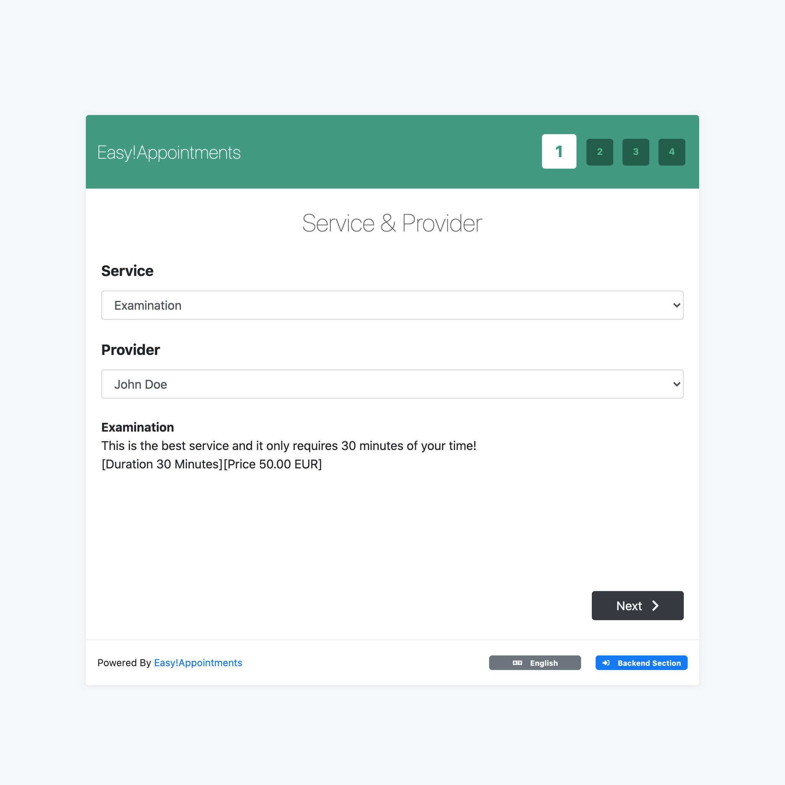

# CLG Modifications
## TODO's
### v0.9 Functional
- Appointment for booking all rooms (hela gården)
  - bröllop, dop, jul, nyår
  - 
- Validations
  - implement "booking rules"
  - 
### v1.0 Basic Features
- Google Calendar
- Multiple
- Appointment for booking a kitchen(etc) without sleeping over
- 

## Remembers
DELETE FROM `ea_users`;
DELETE FROM `ea_user_settings_`;
DELETE FROM `ea_appointments`;
DELETE FROM `ea_services`;
DELETE FROM `ea_services_providers`;
DELETE FROM `ea_secretaries_providers`;

ALTER TABLE `ea_users` AUTO_INCREMENT = 0;
ALTER TABLE `ea_appointments` AUTO_INCREMENT = 0;
ALTER TABLE `ea_services` AUTO_INCREMENT = 0;
ALTER TABLE `ea_secretaries_providers` AUTO_INCREMENT = 0;


ALTER TABLE `ea_services` 
ADD COLUMN `is_all_rooms` BOOLEAN NOT NULL DEFAULT 0 AFTER `id_service_categories`


### Console Usage
php.exe console 

## Additions
- Multiple Customers/Släktingar for same appointment
  - new table: appointment_visitor
    - id, appointment_id, 

- Multiple rooms/services for same appointment
  - new column in "appointments": is_parent
    - This will be true for the first selected room when creating a booking. When editing this one will be loaded, to provide ability to change all "child bookings" at the same time

## Changes
- Appointments:
  - Renamed to: Booking (only in front-end)
  - Usage: Booking rooms by the day
  - New columns: "id_main", "bg_color", "is_all_rooms"
- Language:
  - Additions to swedish
- Customer:
  - Now only indirectly created as a clone of a Secretary
- Secretary:
  - Renamed to: Släkting (only in front-end)
  - Usage: Now used as a "customer with login"

### Önskemål från styrelsen:

- Att man ska kunna skriva in ankomsttid och avresetid i bokningen.  Styrelsen noterar om att bokningsreglerna bör uppdateras med att det är en överlämningstid vid kl. 12, då lämnar man sina rum till nästa boende (man behöver inte nödvändigtvis lämna gården).

- Att det skickas ett automatisk mail en vecka innan bokningen med påminnelse och bilagd boendeinstruktion.

- Att man inte ska kunna göra parallella bokningar utan att även en obekräftad bokning ska blockera från att parallella bokningar görs.

- Att man i bokningen kan fylla i vem som är ”ansvarig” för bokningen (i förlängningen kan man också göra denna person ansvarig för nyckel och brandansvarig).

- Att man kan ange i rumsnamnen vilka som är i Stora Huset och vilka som inte är det.

- Att det kommer upp en periodiserad varning på de utrymmen som inte är ”vinterstödda”. T ex att köket i Mangelboden är avstängt och att Härbret, Mörtstugan, Fiskarboden och Ungkarlshotellet är kallt vintertid.

- Finns ett generellt stöd för helgårdsbokningar? Bra om det går att göra som att boka ett rum ”Hela gården”, och att man även fyller i anledningen till helgårds-bokning. Gärna att det poppar upp en informationstext/länk till bokningsregler när man försöker göra en sådan bokning.

<input type="color" class="form-control" id="bg-color-input" value="#93CFD2">

<h1 align="center">
    <br>
    <a href="https://easyappointments.org">
        
    </a>
    <br>
    Easy!Appointments
    <br>
</h1>

<br>

<h4 align="center">
    A powerful Open Source Appointment Scheduler that can be installed on your server. 
</h4>

<p align="center">
  
  
  
</p>

<p align="center">
  <a href="#about">About</a> •
  <a href="#features">Features</a> •
  <a href="#setup">Setup</a> •
  <a href="#installation">Installation</a> •
  <a href="#license">License</a>
</p>



## About

**Easy!Appointments** is a highly customizable web application that allows customers to book appointments with you 
via a sophisticated web interface. Moreover, it provides the ability to sync your data with Google Calendar so you can 
use them with other services. It is an open source project that you can download and install **even for commercial use**. 
Easy!Appointments will run smoothly with your existing website as it can be installed in a single folder of the 
server and of course share an existing database.

## Features

The application is designed to be flexible enough so that it can handle any enterprise work flow. 

* Customers and appointments management.
* Services and providers organization.
* Working plan and booking rules.
* Google Calendar synchronization.
* Email notifications system.
* Self hosted installation.
* Translated user interface.
* User community support. 

## Setup

To clone and run this application, you'll need [Git](https://git-scm.com), [Node.js](https://nodejs.org/en/download/) (which comes with [npm](http://npmjs.com)) and [Composer](https://getcomposer.org) installed on your computer. From your command line:

```bash
# Clone this repository
$ git clone https://github.com/alextselegidis/easyappointments.git

# Go into the repository
$ cd easyappointments

# Install dependencies
$ npm install && composer install

# Start the file watcher
$ npm start
```

Note: If you're using Linux Bash for Windows, [see this guide](https://www.howtogeek.com/261575/how-to-run-graphical-linux-desktop-applications-from-windows-10s-bash-shell/) or use `node` from the command prompt.

You can build the files by running `npm run build`. This command will bundle everything to a `build` directory.

## Installation

You will need to perform the following steps to install the application on your server:

* Make sure that your server has Apache/Nginx, PHP and MySQL installed.
* Create a new database (or use an existing one).
* Copy the "easyappointments" source folder on your server.
* Make sure that the "storage" directory is writable.
* Rename the "config-sample.php" file to "config.php" and update its contents based on your environment.
* Open the browser on the Easy!Appointments URL and follow the installation guide.

That's it! You can now use Easy!Appointments at your will.

You will find the latest release at [easyappointments.org](https://easyappointments.org).
If you have problems installing or configuring the application visit the
[official support group](https://groups.google.com/forum/#!forum/easy-appointments).
You can also report problems on the [issues page](https://github.com/alextselegidis/easyappointments/issues)
and help the development progress.

## License 

Code Licensed Under [GPL v3.0](https://www.gnu.org/licenses/gpl-3.0.en.html) | Content Under [CC BY 3.0](https://creativecommons.org/licenses/by/3.0/)

---

Website [alextselegidis.com](https://alextselegidis.com) &nbsp;&middot;&nbsp;
GitHub [alextselegidis](https://github.com/alextselegidis) &nbsp;&middot;&nbsp;
Twitter [@alextselegidis](https://twitter.com/AlexTselegidis)

###### More Projects On Github
###### ⇾ [Plainpad &middot; Self Hosted Note Taking App](https://github.com/alextselegidis/plainpad)
###### ⇾ [Questionful &middot; Web Questionnaires Made Easy](https://github.com/alextselegidis/questionful)
###### ⇾ [Integravy &middot; Service Orchestration At Your Fingertips](https://github.com/alextselegidis/integravy)
